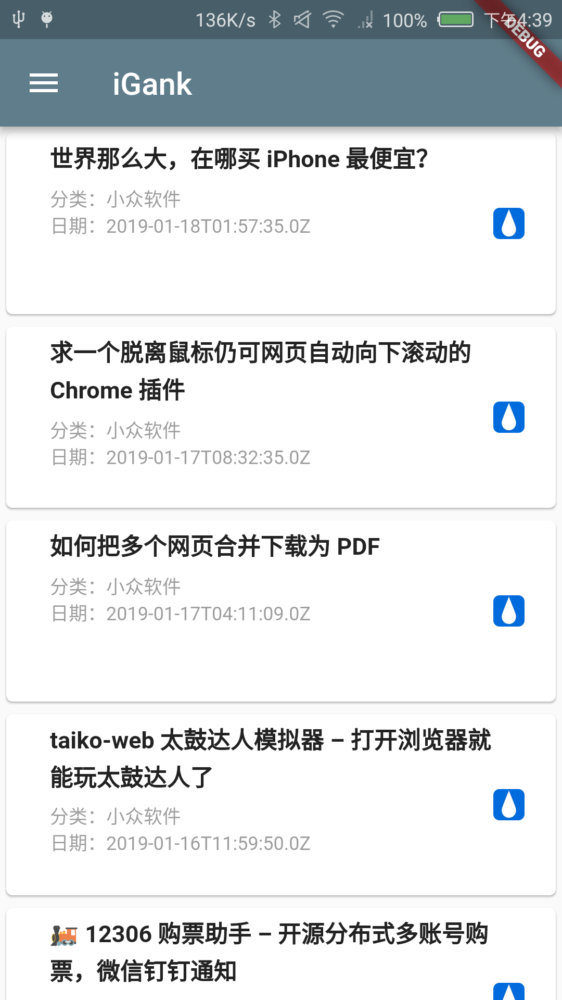
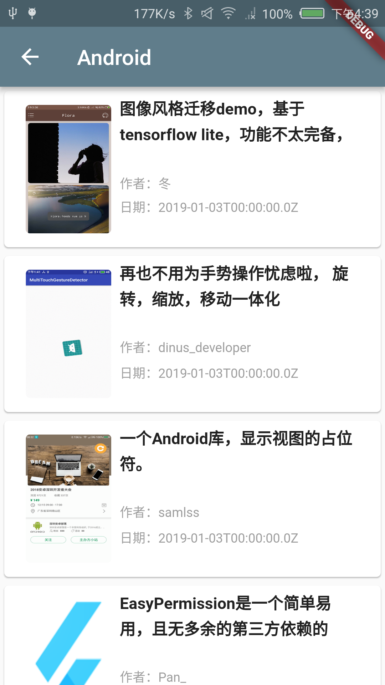

# iGank

>Flutter版Gank.io手机客户端。 A new Flutter application for Gank.io.

#### 最简单的例子学习：   
1. 网络请求  
2. json转对象  
3. 将请求的数据展示到listview  

### 截屏:

     
                   
-----

        
            

----

     
                  

----

                 

 

>Flutter 1.0.0 • channel beta • https://github.com/flutter/flutter.git
Framework • revision 5391447fae (4 weeks ago) • 2018-11-29 19:41:26 -0800
Engine • revision 7375a0f414
Tools • Dart 2.1.0 (build 2.1.0-dev.9.4 f9ebf21297)
